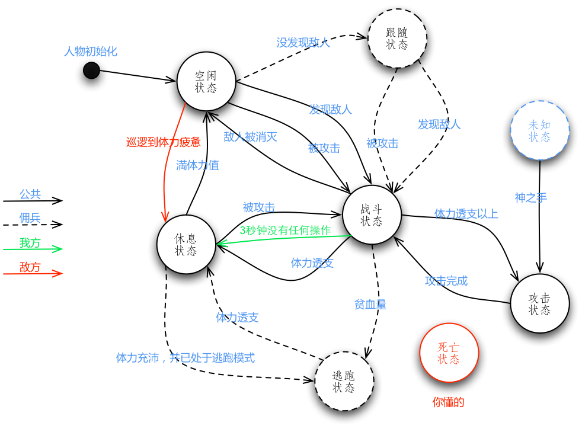

AI相关
=====

## 基本说明 ##

## AI状态列表 ##

- 空闲状态
- 战斗状态
- 休息状态
- 攻击状态
- 跟随状态(**限于佣兵**)
- 逃跑状态(**限于佣兵**)
- 死亡状态

-><-

->AI的状态转换图<-

### 关键字说明 ###
 关键字  | 说明
--------|------
 主角     | 玩家控制的人物。
 佣兵     | 玩家雇佣的士兵，辅助主角战斗。
 敌方     | 要干掉的人物。
 体力值   | 人物做出动作将要消耗的数值。
 体力透支 | 人物的体力值大概低于20%时的状态，这时将不能做出除了喝药以外的任何动作，并且进入**休息状态**。
 体力疲惫 | 人物的体力值大概低于50%时的状态。
 体力充沛 | 人物的体力值大概高于50%时的状态。
 生命垂危 | 人物的生命值大概低于20%时的状态。

### 空闲状态 ###
我方与地方在**空闲状态**执行的操作是不同的。
**我方人物（佣兵）**在**空闲状态**时会进入**跟随状态**，而**主角**则不执行任何操作。
**敌方**则会执行**巡逻**的操作，直到巡逻至**体力疲惫**，会进入**休息状态**，直至恢复満体力值。
若**敌方**拥有高级AI，在他视野中的**敌方**人物发现了敌人(就是**我方**)的话，他自身也会进入**战斗状态**。

##### 进入方式 #####
人物在初始化后立刻进入**空闲状态**。
人物休息完成后会进入**空闲状态**。
人物在已知的敌人全部被消灭后也会进入**空闲状态**。

### 战斗状态 ###
人物处于**体力透支**以上的状态时，会进入**攻击状态**。
**体力透支**后则会进入**休息状态**。
若已知的敌人全部被消灭后则恢复为**空闲状态**。

**胆怯类佣兵**在此状态下有特殊操作，
若**胆怯类佣兵**处于**生命垂危**的状态时，会进入**逃跑状态**。

    其实其他状态下生命垂危都会进入逃跑状态。

##### 进入方式 #####
**空闲状态**、**休息状态**、**跟随状态**下**被攻击**会进入**战斗状态**。
**空闲状态**、**跟随状态**下**发现敌人**会进入**战斗状态**。
**攻击状态**下，攻击完成后回到**战斗状态**。

### 休息状态 ###
**休息状态**下，人物将会原地不动，并且恢复体力值。
**移动**后会切换到**空闲状态**。
此间**发现敌人**将不做任何操作，但是若**被攻击**将切换至**战斗状态**。
若由**体力透支**进入**休息状态**的话，则在恢复至体力充沛前不能做除了喝药以外的任何动作。

**胆怯类佣兵**在此状态下有特殊操作，
若**胆怯类佣兵**是从**逃跑状态**转入**休息状态**的，当体力恢复至**体力充沛**状态时会切换回**逃跑状态**继续逃跑。

##### 进入方式 #####
所有人物在**体力透支**后都会进入**休息状态**。
**敌方**巡逻至**体力疲惫**后也会进入**休息状态**。
而**我方**在**3秒钟**内没有任何操作同样会进入**休息状态**。

### 攻击状态 ###
人物会根据一定规则选择攻击对象，然后选择攻击方式进行攻击。
攻击完成后回到**战斗状态**。

##### 进入方式 #####
在**战斗状态**中，处于**体力透支**以上的状态时进入**攻击状态**。
或者是**我方**经由***神之手***(玩家啦)发动攻击，进入了**攻击状态**。
当然，这是瞬间的。攻击结束后马上会“回到”**战斗状态**。

### 跟随状态 ###
**佣兵**所特有的状态。在这个状态下，若**主角**不在**佣兵**的视野内的话，**佣兵**会跟随主角移动。
若**佣兵**拥有高级AI，在他视野中的**我方**人物发现了敌人的话，他自身也会进入**战斗状态**。
若**佣兵**在此状态**被攻击**也会进入**战斗状态**。

##### 进入方式 #####
**佣兵**由**空闲状态**直接进入**跟随状态**。

### 逃跑状态 ###
**胆怯类佣兵**所特有的状态。在这个状态下，**胆怯类佣兵**将会不接受任何操作。
虽然可以给他喝药，但是他不会做出除了**逃跑**之外的反应。
**胆怯类佣兵**逃跑的目的地是离他最近的场景中的**出入口**。
到达目的地后会离开战场，直到任务结束都不会再出现(由于任务结束后也看不到他，所以其实是在下一次的任务中才会再次出现)。

##### 进入方式 #####
**胆怯类佣兵**处于**生命垂危**的状态时，会进入**逃跑状态**。

### 死亡状态 ###
若**敌方**进入**死亡状态**会从战场永久消失。
若**佣兵**进入**死亡状态**会从战场永久消失，并且下次任务也不会出现，需要重新雇佣。
若**主角**进入**死亡状态**则会任务失败。

##### 进入方式 #####
人物的HP值低于1时就会**死亡**，进入**死亡状态**。

## AI分类 ##
AI主要分为三类，主角、佣兵、敌人。
其中，佣兵会细分为胆怯类、通常类两种。
然后，AI还会分为高级AI和低级AI。高级AI在一定程度上“共有视野“。

## 各细分的AI的不同 ##
暂时空着~~~~

