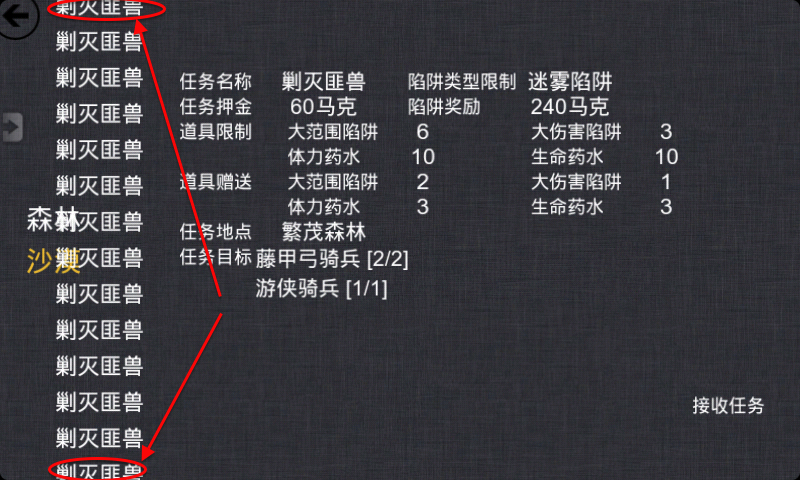

界面测试
=======

测试时间：2013年4月13日下午6:22

---

## 接受任务 ##

### 800x480分辨率 ###
- **OK** 地域名与任务名重叠了
    
- 任务用一个列表显示，没有滚动，结果导致太多任务会有些看不到
    

### 960x640分辨率 ###

## 道具买卖 ##

### 800x480分辨率 ###
- 东西都用一个列表来显示，结果太多东西导致列表越界。下面最后一项与直线重叠了。
    

### 960x640分辨率 ###

## 装备升级 ##        

### 800x480分辨率 ###
- 武器都用一个列表来显示，结果太多东西导致列表越界。下面越过了直线。
    

### 960x640分辨率 ###

